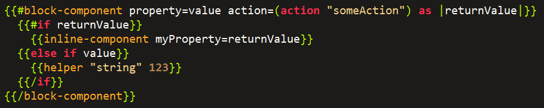
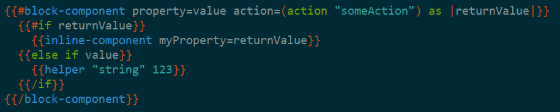

# vim-ember-hbs

`vim-ember-hbs` is a plugin to add Ember Handlebars/HTMLBars syntax highlighting and
indentation to Vim. It supports modern Ember Handlebars syntax like `{{else if` and
`{{#each-in`. An example of the highlighting (and indentation):




## Installation

The easiest way to install `vim-ember-hbs` is using the amazing [Pathogen](https://github.com/tpope/vim-pathogen).
Simply copy/paste the following snippet:

```console
cd ~/.vim/bundle
git clone https://github.com/joukevandermaas/vim-ember-hbs.git
```

Substitute `.vim` for `vimfiles` on Windows (in PowerShell).
